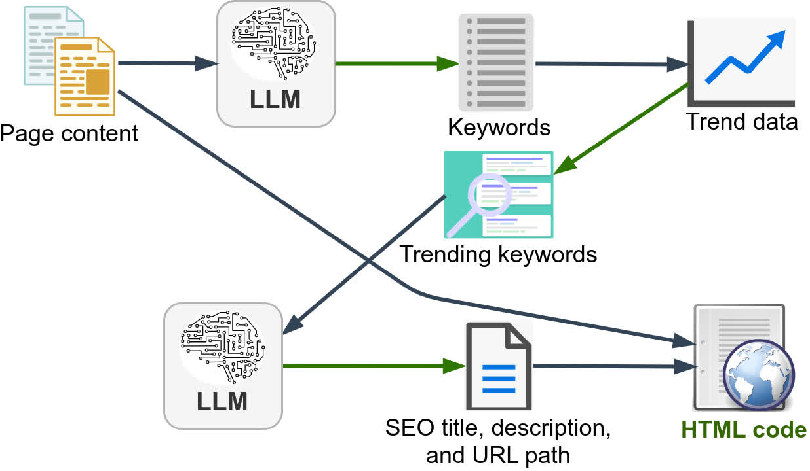
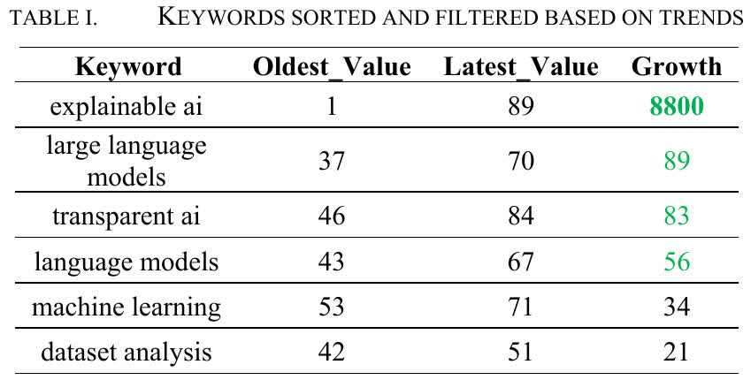

<!-- Copyright (c) 2024 Praneeth Vadlapati -->

#  AutoTrendyKeywords

## Real-time AI-driven trend-based SEO using LLMs

[](./LICENSE.md)
[](https://www.preprints.org/manuscript/202410.1164)
[](https://www.python.org/)
<!-- [](https://medium.com/@praneeth.v/<link here>) -->

> [!NOTE]
> Please star :star: the repository to show your support. <br>

<!-- Workflow images -->
**AutoTrendyKeywords process**: <br>


### Why AutoTrendyKeywords:
- Keywords are essential for SEO to optimize the content for search engines.
- Keywords are decided based on trends when the content is created.
- Trends change frequently, and manual keyword generation may not be up-to-date.
- Manual keyword generation is time-consuming and requires expertise.
- The project uses LLMs to generate real-time SEO keywords based on trends, saving time and resources.
- The project embeds the keywords in the HTML code for better SEO optimization.

An experiment was conducted by writing a blog on my last project [LML-DAP](https://github.com/Pro-GenAI/LML-DAP).
Results below shows the keywords that were trending.

**Trends of the generated keywords**: <br>
 <br>


Created by Praneeth Vadlapati ([@prane-eth](https://github.com/prane-eth))


## :page_facing_up: Research Paper
A **preprint** of the research paper is available on [preprints.org](https://www.preprints.org/manuscript/202410.1164) <br>

## :bookmark_tabs: Citation
To use my paper for reference, please cite it as below:
```bibtex
@article{vadlapati2024autotrendykeywords,
	title = {AutoTrendyKeywords: Real-Time AI-Driven Trend-Based SEO Using LLMs},
	author = {Praneeth Vadlapati},
	year = {2024},
	month = {October},
	publisher = {Preprints},
	journal = {Preprints},
	doi = {10.20944/preprints202410.1164.v1},
	url = {https://www.preprints.org/manuscript/202410.1164},
}
```


## :rocket: Quick Start
Open the file [Experiment-ATK.ipynb](Experiment-ATK.ipynb)
	and find the setup instructions in the first cell.
Run the code. <br>


## :computer: More Projects
For more projects, open the profile: **[@Pro-GenAI](https://github.com/Pro-GenAI)** <br>


## :hammer_and_wrench: Contributing
Contributions are welcome! Feel free to create an issue for any bug reports or suggestions. <br>
To contribute, please star :star: the repository and create an Issue. If I can't solve that, I will allow anyone to create a pull request.<br>


## :identification_card: License
Copyright &copy; 2024 Praneeth Vadlapati <br>
Please refer to the [LICENSE](./LICENSE.md) file for more information. <br>
To request a permission to use my work, please contact me using the link below.


## :warning: Disclaimer
The code is not intended for use in production environments.
This code is for educational and research purposes only.
No author is responsible for any misuse or damage caused by this code.
Use it at your own risk. The code is provided as is without any guarantees or warranty.


## :globe_with_meridians: Acknowledgements
- Special thanks to **Groq** (https://groq.com/) for a fast LLM inference which saved me time for this research project.
- Image Credits:
	- Content: https://pixabay.com/vectors/documents-paper-text-icon-149799/
	- Keywords: https://pixabay.com/vectors/list-checklist-paper-to-do-1778593/
	- Trends data: https://pixabay.com/vectors/chart-trend-icon-arrow-graph-6759438/
	- Filtering Trending keywords: https://pixabay.com/vectors/gui-interface-internet-program-3614763/	
	- LLM: https://pixabay.com/vectors/circuits-brain-network-chip-5076887/
	- Meta description: https://pixabay.com/vectors/file-description-outline-document-6472230/
	- Web page: https://pixabay.com/vectors/document-html-web-internet-public-98478/


## :email: Contact
For personal queries, please find my contact details here: [linktr.ee/prane.eth](https://linktr.ee/prane.eth)

